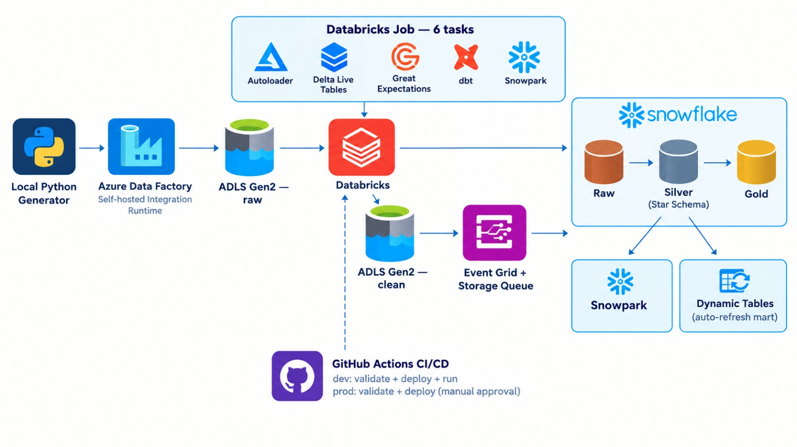
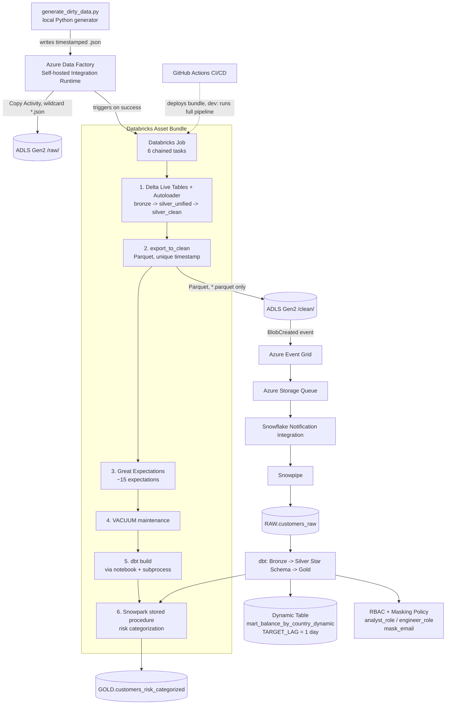
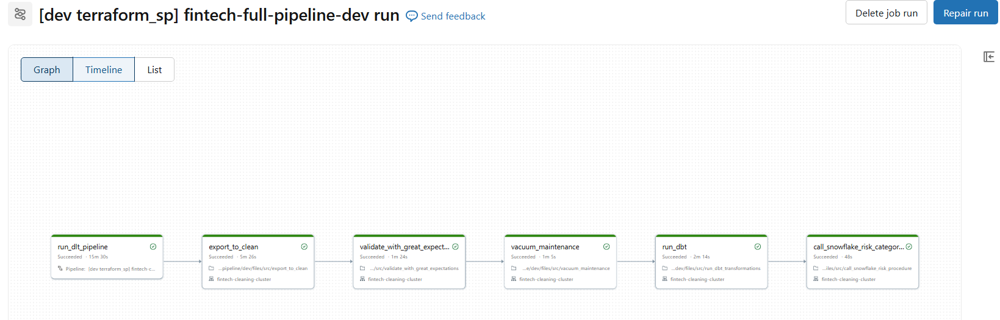
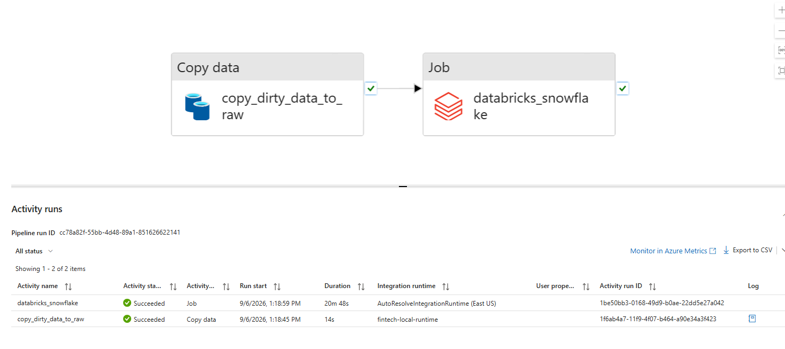
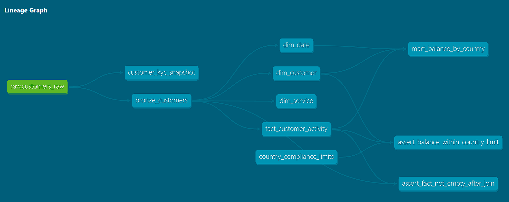
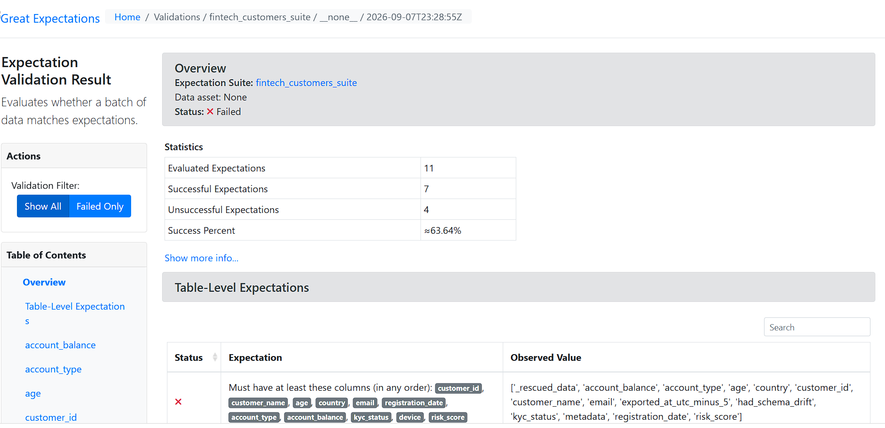
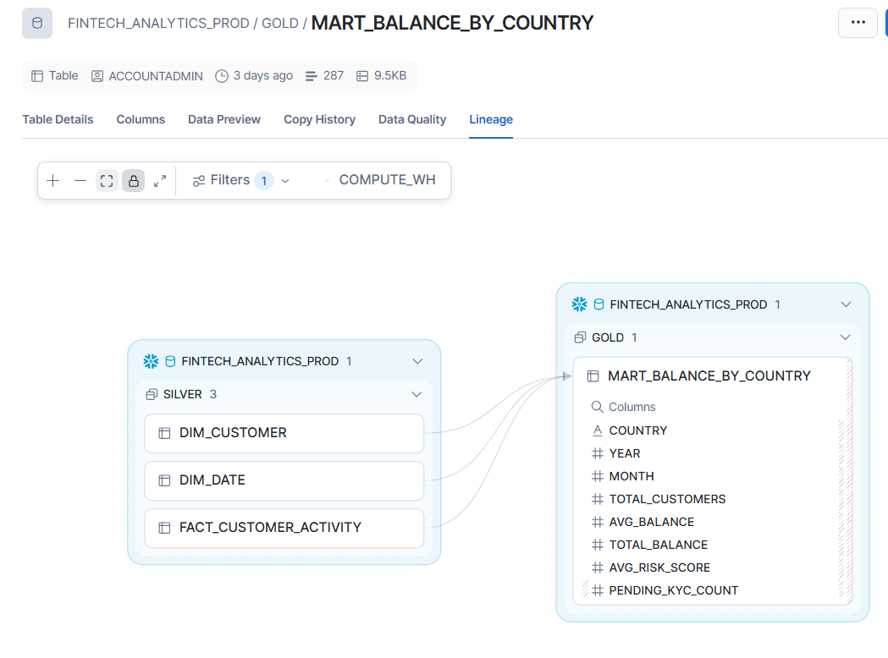
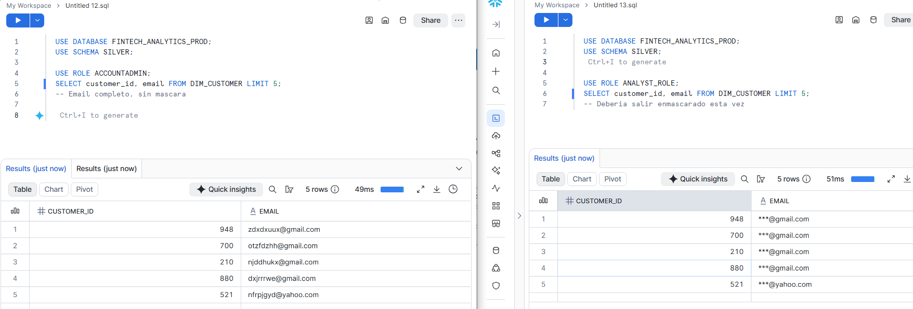

# Fintech Data Pipeline: Azure Data Factory + Databricks + Snowflake + dbt

An end-to-end batch data pipeline simulating a fintech platform's customer/account
data flow: from intentionally messy raw data, through automated ingestion,
declarative cleaning, dbt modeling, stored-procedure risk scoring, role-based
access control, and a CI/CD pipeline that gates deployments on real data-quality
tests — not just syntax checks.

**Companion project (AWS + Airflow + Snowflake, gaming/lottery domain):**
[aws-glue-snowflake-pipeline](https://github.com/DAVID316CORDOVA/aws-glue-snowflake-pipeline)

**Live documentation:**
[dbt docs — lineage & model documentation](https://DAVID316CORDOVA.github.io/azure-databricks-snowflake-pipeline/dbt-docs/) ·
[Great Expectations — Data Docs](https://DAVID316CORDOVA.github.io/azure-databricks-snowflake-pipeline/great-expectations/)



---

## Table of Contents

- [Why This Project Exists](#why-this-project-exists)
- [Architecture](#architecture)
- [Databases, Schemas & Environments](#databases-schemas--environments)
- [Terraform: Infrastructure as Code](#terraform-infrastructure-as-code)
- [Databricks Asset Bundle: What It Manages, and How dev/prod Work](#databricks-asset-bundle-what-it-manages-and-how-devprod-work)
- [dbt: Targeting dev/prod, and What Actually Gets Tested on Every Push](#dbt-targeting-devprod-and-what-actually-gets-tested-on-every-push)
- [Snowpipe: The Actual Commands Used](#snowpipe-the-actual-commands-used)
- [Pipeline Walkthrough](#pipeline-walkthrough)
- [Why Autoloader Here, and Why Snowpipe There](#why-autoloader-here-and-why-snowpipe-there)
- [Why dbt for the Warehouse Layer](#why-dbt-for-the-warehouse-layer)
- [Snowpark: Risk Categorization](#snowpark-risk-categorization)
- [Dynamic Tables vs. dbt Gold](#dynamic-tables-vs-dbt-gold)
- [RBAC & Column Masking](#rbac--column-masking)
- [Data Quality Strategy](#data-quality-strategy)
- [Alerting](#alerting)
- [CI/CD](#cicd)
- [Key Engineering Decisions & Real Bugs Fixed](#key-engineering-decisions--real-bugs-fixed)
- [Evidence](#evidence)
- [Repository Structure](#repository-structure)
- [Running It Yourself](#running-it-yourself)

---

## Why This Project Exists

### Fintech, not gaming/lottery

This is deliberately the second pipeline in a two-project portfolio, built on a
different cloud (Azure instead of AWS) and a different industry narrative.
Fintech customer/account data justifies richer, more defensible data quality
rules than a generic dataset would: KYC completeness, account balance sanity
checks, and risk-score ranges all map to real AML/compliance concerns.

### A custom dirty-data generator, not a public dataset

Public datasets can't guarantee *which* data quality problems exist. A custom
generator ([`scripts/generate_dirty_data.py`](scripts/generate_dirty_data.py))
injects controlled issues on purpose — nulls, duplicates, invalid ages,
malformed emails, schema drift, out-of-range balances, KYC violations, invalid
risk scores — so every downstream test has something real, known, and
reproducible to detect. Each run writes a UTC-5-timestamped file
(`raw_customers_<timestamp>.json`), which matters operationally: it's what lets
Databricks Autoloader recognize each run's output as genuinely new, and what
prevents Azure Data Factory from silently overwriting the previous file in
ADLS.

### No Airflow

Both this project and its AWS companion move data between systems, but neither
uses Airflow as the orchestrator. Each pipeline uses the orchestration tool
native to its own cloud instead: Azure Data Factory here, Amazon MWAA on the
AWS side — a deliberate choice to demonstrate judgment about idiomatic tooling
per platform, not a default habit.

---

## Architecture



---

## Databases, Schemas & Environments

Two fully separate Snowflake databases isolate dev from prod — not just
separate schemas within one database:

| Environment | Database | Schemas |
|---|---|---|
| dev | `FINTECH_ANALYTICS` | `RAW`, `DEV_SILVER`, `GOLD` (dbt prefixes non-default schemas with the target name) |
| prod | `FINTECH_ANALYTICS_PROD` | `RAW`, `SILVER`, `GOLD` |

Each environment has its own Snowpipe (`CUSTOMERS_PIPE_DEV` /
`CUSTOMERS_PIPE_PROD`), its own external stage (`FINTECH_CLEAN_STAGE_DEV` /
`FINTECH_CLEAN_STAGE_PROD`), and — since this was a real bug found and fixed
during the project — its own alert monitoring Snowpipe load failures. Treating
dev and prod as separate databases, rather than separate schemas in one
database, mirrors how the Databricks Asset Bundle also fully separates
dev/prod job definitions, keeping the isolation consistent end to end.

Key tables:

- `RAW.CUSTOMERS_RAW` — Snowpipe's landing target, raw Parquet columns as-is.
- `SILVER.DIM_CUSTOMER`, `SILVER.DIM_DATE`, `SILVER.FACT_CUSTOMER_ACTIVITY` — the Star Schema, built by dbt.
- `GOLD.MART_BALANCE_BY_COUNTRY` — dbt-built mart.
- `GOLD.MART_BALANCE_BY_COUNTRY_DYNAMIC` — the same result, built declaratively as a Dynamic Table instead (see below).
- `GOLD.CUSTOMERS_RISK_CATEGORIZED` — written by the Snowpark stored procedure.

---

## Terraform: Infrastructure as Code

Every Azure resource this pipeline touches is provisioned by Terraform, split
into four files by concern rather than one monolithic file:

| File | What it provisions |
|---|---|
| `providers.tf` | The `azurerm` provider configuration |
| `variables.tf` | Input variables (subscription ID, region, naming, etc.) |
| `storage.tf` | `azurerm_resource_group`, `azurerm_storage_account`, and two `azurerm_storage_container` resources (`raw`, `clean`) |
| `adf.tf` | `azurerm_data_factory`, its Self-hosted Integration Runtime (`azurerm_data_factory_integration_runtime_self_hosted`), the ADLS Gen2 linked service, the Binary sink dataset, and the `azurerm_role_assignment` granting ADF's managed identity **Storage Blob Data Contributor** on the storage account |
| `databricks.tf` | `azurerm_databricks_workspace` |

**Why the `azurerm_role_assignment` matters, specifically:** a Linked Service
alone only tells ADF *how to connect* to the storage account — it does not
grant *permission* to read or write there. RBAC in Azure is a separate layer
from connectivity. Without this explicit role assignment, ADF's managed
identity can authenticate against the storage account but every read/write
call still fails with an authorization error. This is a common gap when
setting up ADF + ADLS Gen2 for the first time — connectivity working is not
the same as being authorized.

**What Terraform does *not* manage in this project** — and why that's a
deliberate scope boundary, not an oversight: the Databricks Job, DLT
Pipeline, and cluster config are managed by the **Databricks Asset Bundle**
(below), not Terraform — Databricks-native resources are more naturally
expressed and versioned as a Bundle than as Terraform `databricks` provider
resources in this setup. Similarly, all Snowflake objects (databases,
schemas, the Snowpipe, the masking policy, roles) are managed via manual SQL
run in Snowsight, not Terraform's `snowflake` provider — a known, explicitly
tracked gap (see the pending-work notes in this repo) rather than something
assumed to be covered.

```bash
cd terraform
terraform init
terraform plan
terraform apply
```

Required variables come from environment (never committed):
`ARM_CLIENT_ID`, `ARM_CLIENT_SECRET`, `ARM_TENANT_ID`, `ARM_SUBSCRIPTION_ID`.

---

## Databricks Asset Bundle: What It Manages, and How dev/prod Work

The Bundle (`fintech_pipeline/databricks.yml` + `resources/*.yml`) is the
single source of truth for every Databricks-native resource this project
uses: the Job definition (all 6 tasks, their order, their cluster), the DLT
Pipeline, and — because `include: resources/*.yml` pulls in whatever's
declared there — any future Databricks resource added the same way, without
touching `databricks.yml` itself.

**How dev and prod are actually separated — this is worth being precise
about, because it's a common point of confusion:** both targets point to
the **exact same** Databricks workspace (`host` is identical in both). What
actually separates them is the `schema` variable:

```yaml
targets:
  dev:
    mode: development
    default: true
    variables:
      schema: dev
  prod:
    mode: production
    variables:
      schema: prod
    permissions:
      - user_name: felix.david.cordova.garcia@gmail.com
        level: CAN_MANAGE
```

Deploying `-t dev` creates Job/Pipeline names prefixed
`[dev <user>] fintech-full-pipeline-dev` and writes to the `dev` schema
inside the Databricks catalog; deploying `-t prod` creates the
production-named equivalents writing to `prod`. `mode: development` also
matters practically — it prefixes dev-deployed resource names with the
deploying user's identity automatically, so two people's dev deployments in
the same workspace never collide.

The `storage_account_key` variable has **no default** in `databricks.yml` on
purpose — its value must come from the `BUNDLE_VAR_storage_account_key`
environment variable at deploy time, so the real key is never written into
any file committed to git. `notification_email` does have a default, since
an email address isn't a secret the same way a key is.

```bash
databricks bundle validate -t dev
databricks bundle deploy -t dev
databricks bundle run fintech_full_pipeline -t dev   # runs and waits for the result
```

---

## dbt: Targeting dev/prod, and What Actually Gets Tested on Every Push

dbt's own `dev`/`prod` targets (declared in `profiles.yml`, selected via
`--target` or the CI environment) point at **two fully separate Snowflake
databases** — `FINTECH_ANALYTICS` for dev, `FINTECH_ANALYTICS_PROD` for
prod — not just separate schemas in one database, which is a stricter
isolation boundary than the Databricks side uses (Databricks separates by
schema within one workspace; Snowflake separates by database entirely). A
custom macro, `generate_schema_name.sql`, is what makes dev models land in
`DEV_SILVER` instead of colliding with prod's `SILVER`.

**What actually runs, and what has to pass, when code is pushed:**

Pushing to `dev` triggers `ci-cd-dev.yml`, which runs `dbt build` as part of
the full 6-task Job — not `dbt run`. The distinction matters: `dbt build`
also runs every test declared in `schema.yml` and every singular test in
`tests/`, and a failed test with `severity: error` (the default) makes
`dbt build` exit non-zero, which makes the notebook's `subprocess` check
raise, which fails the Databricks task, which fails the whole CI/CD
workflow. Concretely, on every push to `dev`, all of the following have to
pass for the workflow to go green:

- `not_null` / `unique` on `dim_customer.customer_id`
- `relationships` from `fact_customer_activity.customer_id` to `dim_customer`
- `dbt_expectations.expect_column_values_to_not_be_null` on `account_balance`
- The compliance-limit singular test (`assert_balance_within_country_limit.sql`)
- The post-join emptiness singular test (`assert_fact_not_empty_after_join.sql`)

Three tests are intentionally `severity: warn` instead of `error` — the
`age` and `risk_score` range checks, and the balance-limit test — because
they're designed to catch the generator's *intentional* dirty data. A `warn`
severity means dbt reports the violation (visible in the run output and in
the published Data Docs) without failing the build over data that's
supposed to look wrong.

Merging to `main` triggers `ci-cd-prod.yml`, which validates and deploys the
same bundle with `-t prod` — but deliberately does **not** re-run `dbt
build` against production data; that would duplicate what dev's run already
proved and spend compute without a human decision in the loop.

---

## Snowpipe: The Actual Commands Used

**1. External stage** — points at the ADLS Gen2 `/clean/` container.
Created once per environment:

```sql
CREATE OR REPLACE STAGE FINTECH_CLEAN_STAGE_DEV
    URL = 'azure://stfintechpipeline01.blob.core.windows.net/clean/dev/'
    STORAGE_INTEGRATION = <your_azure_storage_integration>;

CREATE OR REPLACE STAGE FINTECH_CLEAN_STAGE_PROD
    URL = 'azure://stfintechpipeline01.blob.core.windows.net/clean/prod/'
    STORAGE_INTEGRATION = <your_azure_storage_integration>;
```

**2. Notification Integration** — the Azure-side event bridge (Event Grid →
Storage Queue) that tells Snowflake a new file has landed:

```sql
CREATE OR REPLACE NOTIFICATION INTEGRATION AZURE_FINTECH_NOTIFICATION
    TYPE = QUEUE
    NOTIFICATION_PROVIDER = AZURE_STORAGE_QUEUE
    ENABLED = TRUE
    AZURE_STORAGE_QUEUE_PRIMARY_URI = '<your_storage_queue_uri>'
    AZURE_TENANT_ID = '<your_azure_tenant_id>';
```

**3. The pipes themselves** — one per environment, each pointed at its own
stage, with a `PATTERN` restricting ingestion to actual Parquet output (a
fix added after Snowpipe initially tried to load Spark's internal control
files — `_SUCCESS`, `_started_*`, `_committed_*` — as if they were data):

```sql
USE DATABASE FINTECH_ANALYTICS;
USE SCHEMA RAW;

CREATE OR REPLACE PIPE CUSTOMERS_PIPE_DEV
    AUTO_INGEST = TRUE
    INTEGRATION = 'AZURE_FINTECH_NOTIFICATION'
    AS
    COPY INTO customers_raw
    FROM @fintech_clean_stage_dev
    PATTERN = '.*\\.parquet'
    FILE_FORMAT = (TYPE = 'PARQUET')
    MATCH_BY_COLUMN_NAME = CASE_INSENSITIVE;

USE DATABASE FINTECH_ANALYTICS_PROD;
USE SCHEMA RAW;

CREATE OR REPLACE PIPE CUSTOMERS_PIPE_PROD
    AUTO_INGEST = TRUE
    INTEGRATION = 'AZURE_FINTECH_NOTIFICATION'
    AS
    COPY INTO customers_raw
    FROM @fintech_clean_stage_prod
    PATTERN = '.*\\.parquet'
    FILE_FORMAT = (TYPE = 'PARQUET')
    MATCH_BY_COLUMN_NAME = CASE_INSENSITIVE;
```

`MATCH_BY_COLUMN_NAME = CASE_INSENSITIVE` matters here specifically because
the Parquet schema comes from Spark/Delta column names, and matching by
name rather than position keeps the pipe resilient to column reordering in
future pipeline changes.

---

## Pipeline Walkthrough

### 1. Data generation
See [Why This Project Exists](#why-this-project-exists) above.

### 2. Azure Data Factory: local file → ADLS Gen2

A Self-hosted Integration Runtime, installed on the machine running the
generator, lets ADF's Copy Activity reach a local folder Azure has no direct
visibility into. The pipeline (`pl_copy_local_to_raw`) uses a wildcard source
path (`*.json`) against the local folder, and a Binary sink dataset pointed at
the `raw` container **without** a fixed filename — source and sink both need
to resolve to "a folder," or the copy activity rejects it outright.
"Delete files after completion" keeps the local folder clean of already-
processed files.

On success, the same pipeline triggers a **Databricks Job activity**, pointed
at the deployed Databricks Asset Bundle job — this is what turns "run two
separate systems by hand" into "drop a file, and the rest happens on its own."

### 3. Databricks Job — six tasks, in a deliberate order

1. **`run_dlt_pipeline`** — Delta Live Tables + Autoloader (see next section for why).
2. **`export_to_clean`** — exports the cleaned Silver table to Parquet, uniquely timestamped, into `/clean/{dev|prod}/`.
3. **`validate_with_great_expectations`** — ~15 expectations, before Snowpipe ever sees the data.
4. **`vacuum_maintenance`** — `VACUUM RETAIN 168 HOURS`.
5. **`run_dbt`** — a notebook that shells out to the dbt CLI via `subprocess` (see [Key Engineering Decisions](#key-engineering-decisions--real-bugs-fixed)).
6. **`call_snowflake_risk_categorization`** — calls the Snowpark stored procedure, which reads the Silver table dbt just built — why task order matters here.

### 4. Snowflake auto-ingestion
While Databricks works through tasks 2–6, an independent event chain moves
data into Snowflake — see [Why Autoloader Here, and Why Snowpipe There](#why-autoloader-here-and-why-snowpipe-there).

### 5. dbt: Bronze → Silver Star Schema → Gold
See [Why dbt for the Warehouse Layer](#why-dbt-for-the-warehouse-layer).

### 6. Snowpark stored procedure
See [Snowpark: Risk Categorization](#snowpark-risk-categorization).

### 7. Dynamic Tables
See [Dynamic Tables vs. dbt Gold](#dynamic-tables-vs-dbt-gold).

### 8. RBAC + Masking
See [RBAC & Column Masking](#rbac--column-masking).

---

## Why Autoloader Here, and Why Snowpipe There

Both are auto-ingestion mechanisms that solve the same generic problem —
"pick up new files without polling" — but they sit on two different legs of
this pipeline, and each is the natural fit for its own leg rather than an
interchangeable choice:

**Autoloader, on the Databricks side (local → ADLS `/raw/` → Delta tables):**
this leg is already running inside a Spark cluster, doing DLT-managed,
streaming, schema-evolving transformation work. Autoloader is Spark-native,
integrates directly with Delta Live Tables' expectations and checkpointing,
and its `rescue` schema-evolution mode (see below) is exactly the kind of
control Snowpipe doesn't expose — because Snowpipe isn't a transformation
engine, it's a loader.

**Snowpipe, on the Snowflake side (ADLS `/clean/` → Snowflake `RAW`):** this
leg is a straight load of already-cleaned Parquet into a warehouse table — no
transformation, no schema evolution logic needed, since Great Expectations
already validated the file upstream. Spinning up a Spark cluster just to move
a file into a table would be paying for compute the job doesn't need.
Snowpipe is serverless, event-driven (via Event Grid + a Storage Queue +
Snowflake's own Notification Integration), and billed only for the actual
load — the right-sized tool for "get this file into a table," nothing more.

Put differently: Autoloader is chosen for what it does *inside* the
transformation engine; Snowpipe is chosen for what it avoids needing — a
transformation engine at all.

---

## Why dbt for the Warehouse Layer

Three concrete reasons this project uses dbt rather than hand-written SQL
scripts or stored procedures for everything downstream of `RAW`:

1. **Tests are declarative and colocated with the models they check.**
   `not_null`, `relationships`, `dbt_expectations` range checks, and singular
   business-rule tests (like the compliance-limit check below) live in the
   same project as the SQL that produces the data — not in a separate,
   easily-forgotten validation script.
2. **Lineage and documentation are generated, not maintained by hand.**
   `dbt docs generate` produces the exact lineage graph linked at the top of
   this README — Bronze → Silver Star Schema → Gold → tests, all derived
   automatically from `ref()` calls in the models themselves.
3. **Incremental models and snapshots solve two different real problems
   cleanly.** `fact_customer_activity` is `materialized='incremental'`,
   `unique_key='customer_id'` — only new/changed rows get processed on each
   run. `customer_kyc_snapshot` is a dbt snapshot (`strategy='timestamp'`,
   SCD Type 2) — an actual compliance use case: reconstructing a customer's
   KYC status history at any point in time, which a plain `CREATE TABLE AS`
   can't do without hand-rolling change tracking.

**Concrete evidence this isn't decorative:** the singular test
`assert_balance_within_country_limit.sql`, which cross-references
`fact_customer_activity` against a seed file
(`country_compliance_limits.csv`) of regulatory balance limits per country,
caught **50 real violation rows** on a live run — exactly the rows the
generator's `inject_invalid_balance` function produces on purpose.

---

## Snowpark: Risk Categorization

The sixth Databricks task calls a Snowpark Python stored procedure that reads
the Silver table dbt just built (not raw data — this is why task order in the
Job matters), and buckets `risk_score` into `high` / `medium` / `low_risk`
using Snowpark's DataFrame API — syntax similar to PySpark, executed entirely
inside Snowflake's engine, with no data movement to an external cluster:

```python
# fintech_pipeline/src/call_snowflake_risk_procedure.py (representative —
# verify against the exact file in this repo before treating as canonical)

from snowflake.snowpark import Session
from snowflake.snowpark.functions import col, when, lit

def categorize_customer_risk(session: Session) -> str:
    fact = session.table("SILVER.FACT_CUSTOMER_ACTIVITY")

    categorized = fact.select(
        col("customer_id"),
        col("account_balance"),
        col("risk_score"),
        when(col("risk_score") >= 70, lit("high_risk"))
        .when(col("risk_score") >= 40, lit("medium_risk"))
        .otherwise(lit("low_risk"))
        .alias("risk_category"),
    )

    categorized.write.mode("overwrite").save_as_table(
        "GOLD.CUSTOMERS_RISK_CATEGORIZED"
    )

    return f"Categorized {categorized.count()} customers into risk buckets."
```

**Why Snowpark instead of a plain SQL stored procedure or pulling the data
back into Databricks:** the computation is a straightforward row-level
transformation over data that already lives in Snowflake — pulling it back
into Spark just to bucket a score and push it back would be redundant data
movement for no analytical benefit. Snowpark keeps the computation where the
data already is, while still letting the logic be expressed in Python
(testable, version-controlled) rather than a long `CASE WHEN` buried in SQL.

---

## Dynamic Tables vs. dbt Gold

`mart_balance_by_country_dynamic` produces the same end result as the dbt
Gold model (`mart_balance_by_country`), through a deliberately different
maintenance philosophy — this repo runs both, side by side, as a direct,
demonstrable comparison:

```sql
CREATE OR REPLACE DYNAMIC TABLE GOLD.MART_BALANCE_BY_COUNTRY_DYNAMIC
    TARGET_LAG = '1 day'
    WAREHOUSE = COMPUTE_WH
    AS
    SELECT
        c.country,
        DATE_TRUNC('month', a.activity_date) AS month,
        COUNT(DISTINCT c.customer_id)        AS total_customers,
        AVG(a.account_balance)               AS avg_balance,
        SUM(a.account_balance)               AS total_balance
    FROM SILVER.FACT_CUSTOMER_ACTIVITY a
    JOIN SILVER.DIM_CUSTOMER c
        ON a.customer_id = c.customer_id
    GROUP BY c.country, DATE_TRUNC('month', a.activity_date);
```

| | dbt Gold model | Dynamic Table |
|---|---|---|
| Trigger | Explicit — runs when `dbt build` runs, orchestrated by the Databricks Job | Declarative — Snowflake refreshes on its own, targeting the `TARGET_LAG` freshness SLA |
| Where the logic lives | Versioned `.sql` file in the dbt project, tested by dbt | Versioned in this repo too, but lives as a native Snowflake object, not a dbt model |
| Best fit | When freshness should be tied to a known pipeline run (data only changes when the Job runs anyway) | When freshness should be tied to a wall-clock SLA independent of any specific job run |

Neither is "correct" in the abstract — they're two valid answers to "how
fresh does this mart need to be, and who's responsible for keeping it that
way," included together specifically to make that trade-off visible rather
than asserted.

---

## RBAC & Column Masking

Two roles with genuinely distinct purposes: `analyst_role` (read-only access
to `GOLD`) and `engineer_role` (full access). A masking policy on
`dim_customer.email` shows the full value only to `ACCOUNTADMIN` and
`engineer_role`; every other role sees a masked value.

```sql
CREATE OR REPLACE MASKING POLICY GOLD.MASK_EMAIL AS (val STRING) RETURNS STRING ->
    CASE
        WHEN CURRENT_ROLE() IN ('ACCOUNTADMIN', 'ENGINEER_ROLE') THEN val
        ELSE REGEXP_REPLACE(val, '^.*(?=@)', '***')
    END;

ALTER TABLE SILVER.DIM_CUSTOMER MODIFY COLUMN EMAIL
    SET MASKING POLICY GOLD.MASK_EMAIL;
```

**A real gotcha found and fixed during this project, worth documenting
explicitly:** `dbt` materializes `dim_customer` as a table, which under the
hood runs `CREATE OR REPLACE TABLE` on every `dbt build`. A masking policy
attached via a manual `ALTER TABLE` doesn't survive that — the rebuilt table
is a new object, and Snowflake doesn't carry column-level policies across a
`CREATE OR REPLACE`. Verified empirically: the policy silently detached after
a normal pipeline run. The fix is a dbt `post-hook`, so the policy reattaches
automatically every time the model rebuilds, instead of depending on someone
remembering to re-run an `ALTER TABLE` by hand:

```yaml
models:
  - name: dim_customer
    config:
      post-hook:
        - "ALTER TABLE {{ this }} MODIFY COLUMN email SET MASKING POLICY fintech_analytics_prod.gold.mask_email;"
```

Verified by switching roles and re-running the same query — see the
[Evidence](#evidence) section below.

---

## Data Quality Strategy

Three independent layers, each catching different classes of problems:

1. **Delta Live Tables expectations** (`expect_or_fail`, `expect_or_drop`,
   `expect`) — row-level enforcement at write time.
2. **Great Expectations** (~15 expectations) — column existence, row-count
   bounds, null checks, uniqueness, numeric ranges, set membership, regex
   pattern matching, and distribution statistics. Runs before Snowpipe
   ingests the data. [Live Data Docs here](https://DAVID316CORDOVA.github.io/azure-databricks-snowflake-pipeline/great-expectations/).
3. **dbt tests + dbt-expectations** — schema tests, the compliance-limit
   singular test, `relationships` referential-integrity checks on
   `fact_customer_activity.customer_id`, and SCD Type 2 snapshots.

---

## Alerting

Two independent, verified-working alerting paths, deliberately kept separate
because they cover failures on two different systems:

- **Databricks Job — `email_notifications.on_failure`:** fires when any task
  in the 6-task Job fails. Confirmed working end to end: a real `dbt build`
  failure (caused by an out-of-sync Snowflake credential — see
  [Key Engineering Decisions](#key-engineering-decisions--real-bugs-fixed))
  correctly raised an exception in the notebook, which correctly failed the
  task, which correctly triggered the email.
- **Snowflake native `ALERT` objects — `SYSTEM$SEND_EMAIL`:** since Snowpipe's
  native `ERROR_INTEGRATION` notifications currently only support AWS-hosted
  accounts (this account is Azure-hosted), a scheduled `ALERT` checks
  `COPY_HISTORY` every 15 minutes instead — cloud-agnostic, and it caught a
  real issue: Spark's internal control files (`_SUCCESS`, `_started_*`,
  `_committed_*`) were being picked up by the pipe and failing to parse as
  Parquet. Fixed with a `PATTERN = '.*\\.parquet'` clause on both the dev and
  prod pipes.

Great Expectations, by design, does **not** raise on the dataset's
intentional violations (age, risk score) — those are expected, not incidents
— so it deliberately has no alert path; its results are meant to be reviewed
via the Data Docs site, not paged on.

---

## CI/CD

Two GitHub Actions workflows, deliberately asymmetric:

- **`dev`** — on every push to `dev`: validates the Databricks Asset Bundle,
  deploys it, then **runs the full six-task job and waits for the result**.
  A failed dbt test or Great Expectations check fails the workflow — a real
  end-to-end data-quality gate.
- **`prod`** — on every push to `main` (i.e., every merged PR): validates and
  deploys to `prod`, gated behind a GitHub Environment requiring manual
  approval. Does **not** re-run the full pipeline — that would duplicate what
  dev already proved and spend compute against production data without a
  human decision in the loop.

A branch protection rule on `main` requires the dev workflow's status check
to pass before any PR can merge.

---

## Key Engineering Decisions & Real Bugs Fixed

**`dbt_task` (native) vs. notebook + `subprocess`** — Databricks' native
`dbt_task` proved unreliable for an external Snowflake target authenticated
via secret/password; two attempts caused repeated failed logins that locked
the Snowflake account. The fix: a `notebook_task` that shells out to dbt via
`subprocess`, checking `returncode` and raising on failure — verbose, but
proven to work and to propagate failures correctly (confirmed via the
alerting section above).

**`existing_cluster_id` instead of `new_cluster`** — every attempted
single-node `new_cluster` config was rejected by the Jobs API for this
workspace; the workaround points every task at an already-verified
interactive cluster instead.

**Schema evolution mode: `rescue`** — chosen deliberately over
`failOnNewColumns` or `none`: unexpected fields land in `_rescued_data` and
the stream keeps running, matching a pipeline meant to demonstrate
resilience to messy, evolving data rather than halting on it.

**Test `severity` matters** — the three tests designed to fail on purpose
(age, risk score, balance limits) are set to `severity: warn`, not the
`error` default — a test *designed* to catch intentionally dirty data needs
`warn`; `error` is for violations that represent a real pipeline problem.

**A stale credential locked the Snowflake account, twice, in production
conditions** — after rotating an exposed Snowflake password, the Databricks
secret scope and the local `.env` both needed updating separately; missing
either one caused repeated failed-login attempts against Snowflake, which
triggered account lockout (`390102`) — diagnosed from the actual error
codes returned (`390100` = bad credentials, `390102` = already locked),
not guessed.

**A masking policy silently detaches on `dbt build`** — see
[RBAC & Column Masking](#rbac--column-masking) above; fixed with a
`post-hook`, not a one-time manual `ALTER TABLE`.

**Snowpipe loaded Spark's internal control files as if they were data** —
see [Alerting](#alerting) above; fixed with a `PATTERN` clause on the pipe,
not by manually deleting files after each run.

---

## Evidence

| | |
|---|---|
| Databricks Job — all 6 tasks succeeded |  |
| Azure Data Factory — Copy + Databricks Job activity, both succeeded |  |
| dbt lineage graph |  |
| Great Expectations — 11 expectations evaluated, 4 intentionally failed |  |
| Snowflake native lineage (Horizon Catalog) |  |
| Column masking — same query, `ACCOUNTADMIN` vs `analyst_role` |  |

---

## Repository Structure

```
.
├── scripts/
│   └── generate_dirty_data.py
├── terraform/
│   ├── adf.tf, storage.tf, databricks.tf, ...
├── fintech_pipeline/                  # Databricks Asset Bundle
│   ├── databricks.yml
│   ├── resources/
│   │   └── fintech_job.yml
│   ├── src/
│   │   ├── transformations/my_transformation.py   # DLT pipeline code
│   │   ├── export_to_clean.py
│   │   ├── validate_with_great_expectations.py
│   │   ├── run_dbt_transformations.py
│   │   └── call_snowflake_risk_procedure.py
│   └── dbt_project/                   # dbt project used by the Job
├── docs/
│   ├── screenshots/
│   ├── dbt-docs/                      # published via GitHub Pages
│   └── great-expectations/            # published via GitHub Pages
├── .github/
│   └── workflows/
│       ├── ci-cd-dev.yml
│       └── ci-cd-prod.yml
└── README.md
```

---

## Running It Yourself

```bash
# 1. Provision Azure infrastructure
cd terraform
terraform init && terraform apply

# 2. Deploy the Databricks Asset Bundle
cd ../fintech_pipeline
databricks bundle deploy -t dev

# 3. Generate a batch of dirty data
python scripts/generate_dirty_data.py --rows 5000

# 4. Trigger the ADF pipeline manually (or let the Schedule Trigger do it)
az datafactory pipeline create-run \
  --factory-name adf-fintech-fdcg01 \
  --resource-group rg-fintech-pipeline \
  --name pl_copy_local_to_raw
```

Required environment variables (never committed — see `.gitignore` for
`*.tfvars`, `*.tfstate`, `.databrickscfg`): `ARM_CLIENT_ID`,
`ARM_CLIENT_SECRET`, `ARM_TENANT_ID`, `ARM_SUBSCRIPTION_ID`,
`BUNDLE_VAR_storage_account_key`, `TF_VAR_snowflake_password`,
`DBT_SNOWFLAKE_PASSWORD` (for running dbt locally, e.g. to regenerate docs).